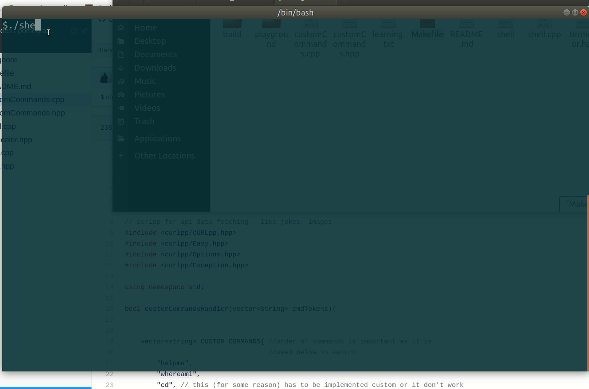

# pomegranate



```
- i built it to remain in touch with c++ which i was not using much at the time.

- pomegranate is a basic linux shell built in c++ for kids. 

```


### some articles and blogs i googled while building it
- https://medium.com/coding-blocks/make-and-cmake-automating-c-build-process-900f569a75db
- https://www.quora.com/What-is-the-difference-between-CMake-and-make
- https://brennan.io/2015/01/16/write-a-shell-in-c/
- https://www.geeksforgeeks.org/making-linux-shell-c/
- https://www.lifewire.com/curl-definition-2184508


`how did i include external c++ linux libraries on linux??? - thanks to these.`
- https://stackoverflow.com/questions/24233138/how-to-compile-curlpp-on-ubuntu
- https://stackoverflow.com/questions/26854794/compile-issues-with-curlpp-undefined-reference-to-symbol-curl-easy-setoptcur
- https://stackoverflow.com/questions/10358745/how-to-use-libraries


